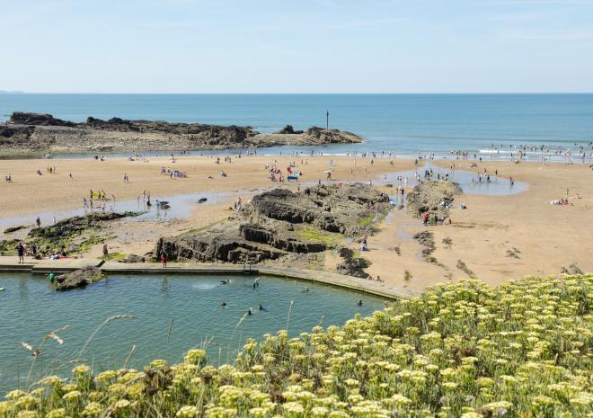
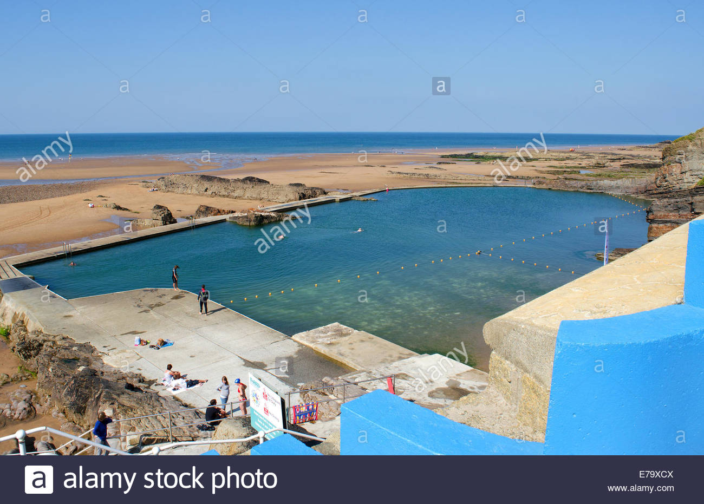
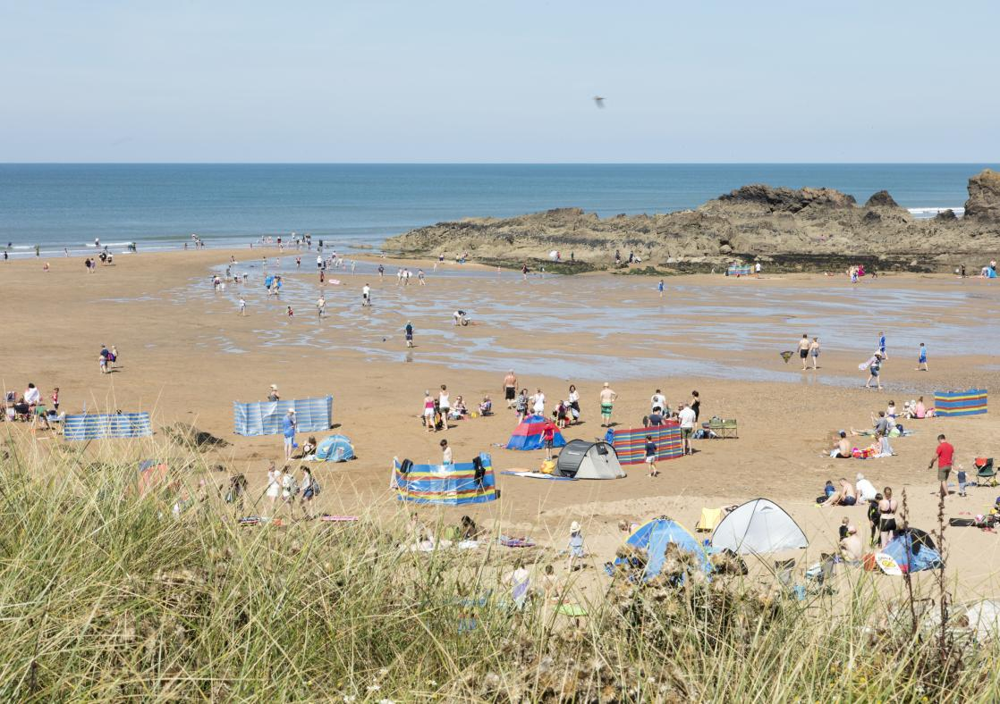
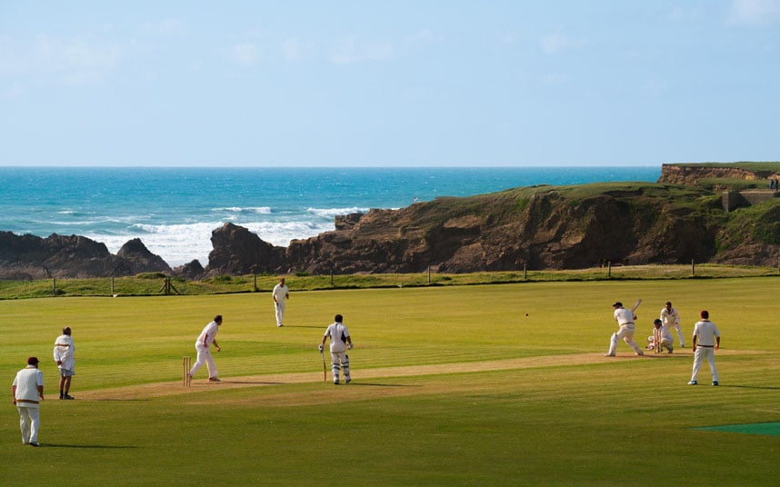
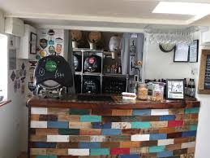

```{r setup, include=FALSE}
knitr::opts_chunk$set(echo = TRUE)
```

## Bude


Bude is a small seaside resort town in north Cornwall, England, UK, in the civil parish of Bude-Stratton and at the mouth of the River Neet (also known locally as the River Strat). It is sometimes formerly known as Bude Haven.[4] It lies southwest of Stratton, south of Flexbury and Poughill, and north of Widemouth Bay and is located along the A3073 road off the A39. Bude is twinned with Ergué-Gabéric in Brittany, France.[5] Bude's coast faces Bude Bay in the Celtic Sea, part of the Atlantic Ocean. The population of the civil parish can be found under Bude-Stratton.

```{r, include=FALSE}
library(ggmap)
library(jpeg)
library(tidyverse)
library(magick)
```

```{r message=FALSE, warning=FALSE, echo = FALSE}
bd <- geocode("bude")
map <- get_map(bd)
bb <- attr(map, "bb")
bbox <- bb2bbox(bb)

map <- get_map(bd, zoom=16)
ggmap(map) +
  geom_point(
    aes(x = lon, y = lat),
    data = bd, color = "red", size = 5
  )


```

\newpage

## Bude road map

```{r message=FALSE, warning=FALSE, echo = FALSE}
roadmap <- get_map(location=bd, maptype = "roadmap",zoom= 17)
ggmap(roadmap)+
  geom_point(
    aes(x = lon, y = lat),
    data = bd, color = "blue", size = 5
  )

```

## Watercolor road map

```{r message=FALSE, warning=FALSE, echo = FALSE}

watercolor <- get_map(location=bd, maptype = "watercolor",zoom= 17)
ggmap(watercolor)+
  geom_point(
    aes(x = lon, y = lat),
    data = bd, color = "green", size = 5
  )

```

## Vacation spots

Summerleaze Beach:

Popular sandy stretch featuring a saltwater rock pool, beach huts (fee), a cafe & ample parking.





Crooklets Beach:

Crooklets is very popular with surfers and is home to the Bude Surf Life Saving Club.  The beach has great facilities including a large car park, level access and viewing area, a play area, skate park, beach cafe, showers, amusements and pubs close by. 




Cricket Grounds:

England's most beautiful cricket grounds




```{r message=FALSE, warning=FALSE, echo = FALSE}
locationall <- c("Summerleaze Beach","Crooklets Beach","Bude Cornwall Cricket Club")
gcall <- geocode(locationall)
mapall <- get_map(gcall)
bball <- attr(mapall, "bb")
bbox <- bb2bbox(bball)

map_road <- get_map(location=gcall, maptype = "roadmap",zoom= 16)

map <- ggmap(map_road)+
  geom_point(
    aes(x = lon, y = lat),
    data = gcall, color = "red", size = 3
  )

map <- map+ annotate("text", x = -4.553, y = 50.831, label = "Summerleaze Beach")
map <- map+ annotate("text", x = -4.555, y = 50.8362, label = "Crooklets Beach")
map <- map+ annotate("text", x = -4.554, y = 50.833, label = "Bude Cornwall Cricket Club")
map
```

\newpage

```{r message=FALSE, warning=FALSE, echo = FALSE}
map_water <- get_map(location=gcall, maptype = "watercolor",zoom= 16)

mapn <- ggmap(map_water)+
  geom_point(
    aes(x = lon, y = lat),
    data = gcall, color = "purple", size = 3
  )
mapn <- mapn+ annotate("text", x = -4.553, y = 50.831, label = "Summerleaze Beach")
mapn <- mapn+ annotate("text", x = -4.555, y = 50.8362, label = "Crooklets Beach")
mapn <- mapn+ annotate("text", x = -4.554, y = 50.833, label = "Bude Cornwall Cricket Club")
mapn
```


## PUB nearby



\newpage

The Barrel at Bude:

The pub also provides popular snacks including Cornish with Cornish Pasty crisps and Cornish Charcuterie salami, making it one of the most visited pubs near the Bude resort. 


\newpage

## see on map

```{r message=FALSE, warning=FALSE, echo = FALSE}
pub <- geocode("The Barrel at Bude")
mappub <- get_map(pub)
bbpub <- attr(mappub, "bb")
bboxpub <- bb2bbox(bbpub)

mappub <- get_map(pub, zoom=16)

ggmap(mappub) +
  geom_point(
    aes(x = lon, y = lat),
    data = pub, color = "red", size = 3
  )
```


```{r message=FALSE, warning=FALSE, echo = FALSE}
from <- "The Barrel at Bude"
to <- "Bude Cornwall Cricket Club"
route_df <- route(from, to, structure = "route")

mappub <- get_map("Bude", zoom = 16)
mappp <- ggmap(mappub) +  
  geom_path(
    aes(x = lon, y = lat), colour = "green", size = 1,
    data = route_df, lineend = "round"
  )

mappp <- mappp+ annotate("text", x = -4.5, y = 50, label = "The Barrel at Bude")
mappp <- mappp+ annotate("text", x = -4.5, y = 50, label = "Bude Cornwall Cricket Club")
mappp
```
##Some Hotels:

```{r message=FALSE, warning=FALSE, echo = FALSE}
map3 <- get_map(location = "Bude", zoom= 14)
df <- data.frame(location = c('An Mor', 'Edgcumbe Hotel', 'Sunrise Guest House'), color = 'blue', stringsAsFactors = FALSE)
locs_geo <- geocode(df$location)
df <- cbind(df, locs_geo)
ggmap(map3) + geom_point(data = df, aes(x = lon, y = lat))

```

## Citations

https://www.google.com/search?q=Summerleaze+Beach&rlz=1C1SQJL_enUS785US785&oq=Summerleaze+Beach&aqs=chrome..69i57j0j69i60j0l3.1120j0j4&sourceid=chrome&ie=UTF-8
https://www.telegraph.co.uk/travel/destinations/europe/united-kingdom/galleries/Englands-most-beautiful-cricket-grounds/cricket-bude/
https://www.google.com/search?rlz=1C1SQJL_enUS785US785&biw=1500&bih=821&tbm=isch&sa=1&ei=pOW6WtPvFdCotQXT3IPQDQ&q=bude&oq=bude&gs_l=psy-ab.3..0i67k1j0l4j0i67k1j0l4.748.1253.0.1691.2.2.0.0.0.0.171.308.0j2.2.0....0...1c.1.64.psy-ab..0.2.306....0.dQT71VLRynM#imgrc=XgmsYBoCHSv0QM:
https://www.google.com/search?rlz=1C1SQJL_enUS785US785&biw=1500&bih=821&tbm=isch&sa=1&ei=tee6Wr-jB-SwtgXL0ZWYAw&q=Summerleaze+Beach&oq=Summerleaze+Beach&gs_l=psy-ab.3..0i67k1j0l3j0i24k1l6.504.504.0.1045.1.1.0.0.0.0.116.116.0j1.1.0....0...1c.1.64.psy-ab..0.1.115....0.FlxaEpeeRQg#imgrc=1hElMQWcBRDyrM:
https://www.visitcornwall.com/beaches/lifeguards-seasonal/north-coast/bude/crooklets-beach
